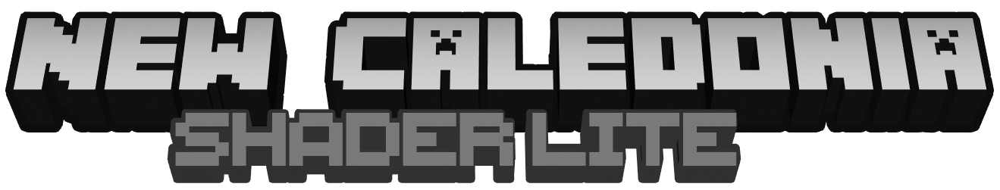

# Lite Shader Pack

<!---->
<!---->

 
 
    
 

## Download

See [releases](https://github.com/NewCaledoniaDevTeam/LITE_ShaderPack/releases) or visit [download.newcaledonia.ml](http://download.newcaledonia.ml/)

## Release notes

See [Changelog](Changelog.txt).

## Supported platforms

- iOS
- Android
- Windows 10 [Required settings because of RTX]

## Tested on

- Minecraft Bedrock 1.16.50, Apple iPad Pro, iOS 14.0
- Minecraft Bedrock 1.16.40, Google Pixel 1, Android 10
- Minecraft Bedrock 1.16.40, Google Pixel 3, Android 11
- Minecraft Bedrock 1.16.40, Samsung Galaxy S7, Android 8
- Minecraft Bedrock 1.16.40, multiple Windows 10 computers [Textures only]

## Author

- PiSaucer
- Mountain Top

## License
[MIT](LICENSE)
